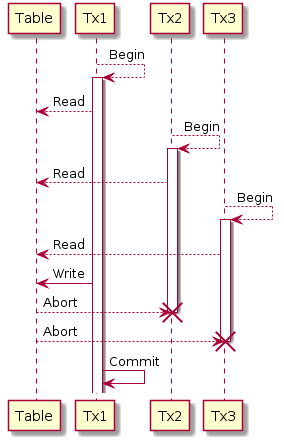
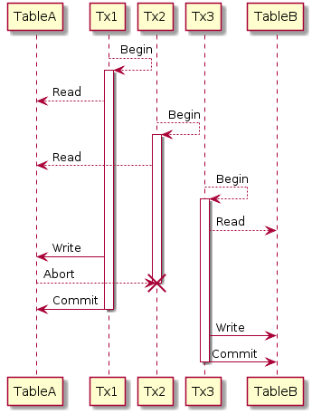
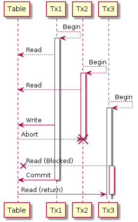

# An emulator for Cloud Spanner

## Install

```
go get github.com/gcpug/handy-spanner/cmd/handy-spanner
```

The Spanner emulator uses sqlite3 internally. You may need to build go-sqlite3 explicitly.
It also requires cgo to use sqlite3.

```
go get -u github.com/mattn/go-sqlite3
go install github.com/mattn/go-sqlite3
```

## Usage

### Run as an independent process

```
./handy-spanner
```

or

```
docker run --rm -it -p 9999:9999 handy-spanner
```

It runs a hand-spanner server as a process. It serves spanner gRPC server by port 9999 by default.

#### Access to the server

The google-cloud-go, the official Spanner SDK, supports to access an emulator server.
Set the address to an emulator server to environment variable `SPANNER_EMULATOR_HOST`, then google-cloud-go transparently use the server in the client.

So if you want to replace spanner server with the handy-spanner you run, just do:

```
export SPANNER_EMULATOR_HOST=localhost:9999
```

#### Schema setup

The handy-spanner server has no databases nor tables by default. You need to create them by yourself. You can prepare them at startup.

handy-spanner accepts some command-line arguments to prepare schema.

* `schema`: Path to a DDL file which handy-spanner creates at startup
* `project`: The project the DDL is applied.
* `instance`: The instance the DDL is applied.
* `database`: The database the DDL is applied.

If you prepare schema at startup, these 4 arguments are required.

#### Implicit creation of databases

Without schema setup, databases are created automatically by your database access.

handy-spanner creates a database when a session to the database is created. In detail, when `CreateSession` or `BatchCreateSessions` is called, the accessed database is created.

#### Database operations

You can also operate databases by your applications. If you need additional databases or database alterations, you need to follow this section.

As Cloud Spanner supports, there are dedicated gRPC service for instance and database operations for Spanner.

* Instance operations
  * [Document](https://cloud.google.com/spanner/docs/reference/rpc/google.spanner.admin.instance.v1)
  * [Protobuf](https://github.com/googleapis/googleapis/blob/master/google/spanner/admin/instance/v1/spanner_instance_admin.proto)
* Database operations
  * [Document](https://cloud.google.com/spanner/docs/reference/rpc/google.spanner.admin.database.v1)
  * [Protobuf](https://github.com/googleapis/googleapis/blob/master/google/spanner/admin/database/v1/spanner_database_admin.proto)

handy-spanner also supports these gRPC services so that you can operate databases. The gRPC services are provided in the same address to the normal gRPC service. It means it is provided in `localhost:9999` by default.

It seems most clients for each language for these gRPC services provided Google Cloud Platform dont support `SPANNER_EMULATOR_HOST` to connect an emulator server, so you need to setup a client to connect an emulator server explicitly. For Go, you can refer [examples](./fake/example_test.go) to connect an emulator server.

### Run as a buillt-in server in Go

If you use a handy-spanner server in tests in Go, it's easier to run it in a process.
See an [example](https://github.com/gcpug/handy-spanner/blob/master/fake/example_test.go) for the details.

Note that the tests highly depend on handhy-spanner, which means you cannot switch the backend depending on the situation. If you want to test on both Cloud Spanner and handy-spanner, it's better to use a handy-spanner server as an independent process.

#### Database operations

handy-spanner provides utility functions to operate databases. For the detail, please refer [examples](./fake/example_test.go).

* `ParseAndApplyDDL`
  * You can pass `io.Reader` as a schema file to apply DDL to a database.
* `ApplyDDL`
  * You can pass `ast.DDL` as an already parsed definition to apply DDL to a database.

You can also operate databases or instances as Cloud Spanner supports. Please also refer _Run as an independent process_ section.

## Can and Cannot

### Supported features

* Read
   * Keys and KeyRange as KeySet
   * Secondary index
   * STORING columns for secondary index
   * Respect column orders for index
* Query
   * Select result set by column name and *
   * Most operators in WHERE clause: IN, BETWEEN, IS NULL
   * Conditions in WHERE clause: =, !=, >, <, AND, OR
   * Order By keyword with ASC, DESC
   * Group By and Having statement
   * LIMIT OFFSET
   * SELECT alias
   * Query Parameters
   * Literals
   * JOINs: COMMMA, CROSS, INNER, LEFT/RIGHT/FULL OUTER
      * FULL OUTER has some limitations
   * Subquery
   * SET operations: UNION, INTERSECT, EXCEPT
   * UNNEST: IN UNNEST, FROM UNNEST
   * Functions (partially)
   * Arithmetic operations
* Mutation
   * All mutation types: Insert, Update, InsertOrUpdate, Replace, Delete
   * Commit timestamp
* Transaction
   * Isolation level: SERIALIZABLE
* DML
   * Insert, Update, Delete
   * Batch DML
* DDL
   * CreateTable, CreateIndex only
   * Respect INTERLEAVE
* Data Types
   * Int, Float, String, Bool, Byte, Date, Timestamp, Array<Any>, Struct
* [Information Schema](https://cloud.google.com/spanner/docs/information-schema)
   * partially supported

### Not supported features

* Transaction
   * Timestamp bound read
* Query
   * Strict type checking
   * More functions
   * Partionan Query
   * EXCEPT ALL and INTERSECT ALL (because of sqlite)
   * FULL OUTER JOIN
     * Not support table alias. Use `*` for now
     * Not support ON condition. Use USING condition for now
   * Merging INT64 and FLOAT64 in SET operations
   * Array operations
* DDL
   * Alter Table, Drop Table, Drop Index
   * Database management
   * Long running operations
* Replace
   * wrong behavior on conflict

## Implementation

### Transaction simulation

handy-spanner uses sqlite3 in [Shared-Cache Mode](https://www.sqlite.org/sharedcache.html). There is a characteristic in the trasactions.

* Only one transaction can hold write lock per database to write database tables.
    * Other transactions still can hold read lock.
* Write transaction holds write lock against database tables while writing the tables.
    * Other read transactions cannot read the table while locked
* Read transaction holds read lock against database tables while reading the tables.
    * Other read transactions can read the table by holding read lock
    * Write transaction cannot write the table while read-locked

If we simply use the transactions, dead lock should happen in read and write locks. To simulate spanner transactions correctly as possible, handy-spanner manages sqlite3 transactions inside.

* Each spanner transaction starts own sqlite3 transaction.
* Only one spanner transaction can hold write lock per database.
* While a transaction holds write lock, other spanner transactions cannot newly get read or write lock.
* When write transaction tries to write a table, it forces transactions that hold read lock to the table to release the lock.
   * The transactions become "aborted"
* The aborted transactions are expected to be retried by the client.

 

### DML

Because of transaction limitations, DML also has limitations.

When a transaction(A) updates a table, other transactions cannot read/write the table until the transaction(A) commits. This limitation may become an inconsistency to the Cloud Spanner. Other limitations are same to mutations with commit.



## Feature Request and Bug Report

Feature requests and any bug reports are welcome.

There are many things to implement features and make better compatibility to Cloud Spanner. Now I'm prioritizing features by on-demand from users and me. Please create an issue if you find lack of a feature to use handy-spanner or imcompatibility to Cloud Spanner.

#### Feature request

Please describe what feature you want. It's the best to refer a Cloud Spanner's document for the feature. If the feature is partiality implemented or wrong behavior you expected, please also see a Bug Report section.

#### Bug report

Please describe a reproducable conditions. If you describe more information about the bug, it makes more easir to fix the bug.

* Schema
* Initial Data
* Query or any requests you run
* Actual behavior
* Expected behavior
* Document in Cloud Spanner

## Copyright

* Author: Masahiro Sano ([@kazegusuri](https://github.com/kazegusuri))
* Copyright: 2019 Masahiro Sano
* License: Apache License, Version 2.0
